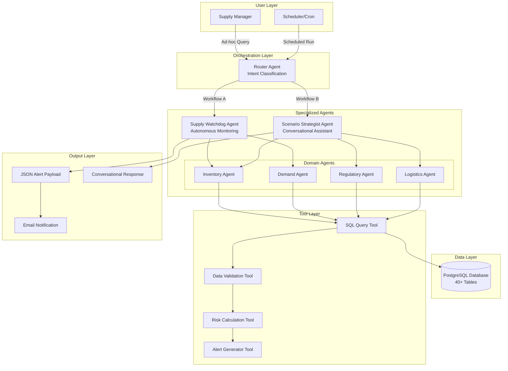

# Part 1: Architectural Design - Multi-Agent System Blueprint

## Executive Summary

This document outlines the **Multi-Agent Architecture** for the Clinical Supply Chain Control Tower, designed to automate risk detection and enable intelligent decision-making across complex pharmaceutical supply chains.

## 1. System Architecture Overview

### 1.1 High-Level Architecture



## 2. Agent Definitions

### 2.1 Router Agent (Orchestrator)

**Purpose:** Entry point that classifies user intent and routes to appropriate workflow agent.

**Responsibilities:**
- Determine if request is scheduled monitoring (Workflow A) or ad-hoc query (Workflow B)
- Extract key parameters (trial ID, country, batch number, etc.)
- Route to appropriate specialized agent

**Key Logic:**
```python
if request_type == "scheduled":
    route_to(SupplyWatchdogAgent)
elif request_type == "conversational":
    route_to(ScenarioStrategistAgent)
```

**Tables Accessed:** None (pure routing logic)

---

### 2.2 Supply Watchdog Agent (Workflow A)

**Purpose:** Autonomous monitoring agent that runs on schedule to detect supply chain risks.

**Responsibilities:**
1. **Expiry Alert Detection:**
   - Query allocated materials expiring within 90 days
   - Categorize by criticality (Critical <30, High <60, Medium <90)
   - Group by trial, country, and material

2. **Shortfall Prediction:**
   - Compare projected demand vs. current inventory
   - Forecast stock-out dates within 8-week horizon
   - Identify at-risk trials and countries

**Sub-Agents Orchestrated:**
- **Inventory Agent** - Queries batch locations, expiry dates
- **Demand Agent** - Analyzes enrollment rates and projections

**Output:** Structured JSON payload for alert system

**Tables Utilized:**
- `Allocated Materials` (reserved batches)
- `Available Inventory Report` (current stock)
- `Enrollment Rate Report` (demand signals)
- `Country Level Enrollment` (actual vs. projected)
- `Affiliate Warehouse Inventory` (location-specific stock)

**Interaction Flow:**
```
SupplyWatchdog → InventoryAgent.get_expiring_batches()
              → DemandAgent.get_projected_demand()
              → RiskCalculator.compare_supply_demand()
              → AlertGenerator.create_json_payload()
```

---

### 2.3 Scenario Strategist Agent (Workflow B)

**Purpose:** Conversational assistant for ad-hoc supply chain decision support.

**Responsibilities:**
- Answer complex queries like: *"Can we extend expiry of Batch #123 for German trial?"*
- Validate feasibility across three dimensions:
  1. **Technical:** Re-evaluation history
  2. **Regulatory:** Country-specific approvals
  3. **Logistical:** Timeline constraints
- Provide evidence-based reasoning with data citations

**Sub-Agents Orchestrated:**
- **Inventory Agent** - Batch details and current status
- **Regulatory Agent** - Approval status and requirements
- **Logistics Agent** - Shipping timelines and lead times

**Output:** Natural language response with data citations

**Tables Utilized:**
- `Re-Evaluation` (extension history)
- `RIM` (Regulatory Information Management)
- `Material Country Requirements` (country-specific rules)
- `IP Shipping Timelines` (logistics lead times)
- `QDocs` (quality documentation)
- `Allocated Materials` (batch reservation status)

**Interaction Flow:**
```
ScenarioStrategist → Parse user query
                   → InventoryAgent.get_batch_details(batch_id)
                   → RegulatoryAgent.check_extension_approval(country, material)
                   → LogisticsAgent.get_shipping_timeline(country)
                   → Synthesize feasibility decision
                   → Generate response with evidence
```

---

### 2.4 Inventory Agent (Domain Specialist)

**Purpose:** Expert in all inventory-related data and operations.

**Responsibilities:**
- Query batch locations, quantities, and expiry dates
- Track allocation status (reserved vs. available)
- Monitor warehouse-level stock positions

**Tables Owned:**
- `Allocated Materials`
- `Available Inventory Report`
- `Affiliate Warehouse Inventory`
- `Warehouse Inventory Report`

**Key Tools:**
- `get_batch_by_id(batch_id)`
- `get_expiring_inventory(days_threshold, material_filter)`
- `get_warehouse_stock(warehouse_id, material_id)`

---

### 2.5 Demand Agent (Domain Specialist)

**Purpose:** Expert in enrollment forecasting and demand signals.

**Responsibilities:**
- Analyze historical enrollment rates
- Project future demand based on trends
- Identify demand spikes or drops

**Tables Owned:**
- `Enrollment Rate Report`
- `Country Level Enrollment`
- `Projected Demand` (if exists)

**Key Tools:**
- `get_enrollment_trend(trial_id, country, weeks_back)`
- `project_demand(trial_id, country, weeks_ahead)`
- `compare_actual_vs_projected(trial_id, country)`

---

### 2.6 Regulatory Agent (Domain Specialist)

**Purpose:** Expert in regulatory compliance and approval tracking.

**Responsibilities:**
- Check shelf-life extension approval status
- Validate country-specific material requirements
- Track submission and approval timelines

**Tables Owned:**
- `RIM` (Regulatory Information Management)
- `Material Country Requirements`
- `Re-Evaluation`
- `QDocs` (quality certificates)

**Key Tools:**
- `check_extension_approved(material_id, country)`
- `get_reeval_history(batch_id)`
- `get_country_requirements(material_id, country)`

---

### 2.7 Logistics Agent (Domain Specialist)

**Purpose:** Expert in shipping timelines and distribution logistics.

**Responsibilities:**
- Provide shipping lead times by country/route
- Track order and distribution status
- Assess feasibility of time-sensitive operations

**Tables Owned:**
- `IP Shipping Timelines`
- `Distribution Order Report`
- `Shipment tracking tables` (if available)

**Key Tools:**
- `get_shipping_timeline(origin, destination)`
- `check_order_status(order_id)`
- `calculate_latest_action_date(destination, required_date)`

---

## 3. Agent Interaction Patterns

### 3.1 Workflow A: Supply Watchdog (Scheduled)

```
Scheduler (Cron)
    ↓
Router Agent: "Run daily monitoring"
    ↓
Supply Watchdog Agent
    ├→ Inventory Agent: "Get batches expiring in 90 days"
    │   └→ SQL Tool → Database
    │       └→ Returns: List of expiring batches
    │
    ├→ Demand Agent: "Get projected demand for next 8 weeks"
    │   └→ SQL Tool → Database
    │       └→ Returns: Demand forecast by trial/country
    │
    └→ Risk Calculation Tool
        └→ Compare supply vs demand
            └→ Alert Generator Tool
                └→ JSON Payload → Email System
```

### 3.2 Workflow B: Scenario Strategist (Interactive)

```
Supply Manager: "Can we extend Batch #X123 for Germany?"
    ↓
Router Agent: Extract {batch_id: X123, country: Germany, action: extend}
    ↓
Scenario Strategist Agent
    ├→ Inventory Agent: "Get batch X123 details"
    │   └→ SQL Tool → Returns: {material, expiry, location, status}
    │
    ├→ Regulatory Agent: "Check extension approval for material Y in Germany"
    │   └→ SQL Tool → Returns: {approved: true, submission_date: ...}
    │
    ├→ Logistics Agent: "Get shipping timeline to Germany"
    │   └→ SQL Tool → Returns: {lead_time_days: 14}
    │
    └→ Synthesize feasibility decision
        └→ Response: "Yes, feasible because:
            1. Material has prior re-evaluation (table: Re-Evaluation)
            2. Extension approved in Germany (table: RIM)
            3. Sufficient time: 14-day lead time (table: IP Shipping)"
```

## 4. Separation of Concerns

### 4.1 Why Multiple Agents?

| Agent | Primary Concern | Why Separate? |
|-------|----------------|---------------|
| **Router** | Intent classification | Decouples user interface from business logic |
| **Supply Watchdog** | Autonomous monitoring | Isolated workflow with specific output format |
| **Scenario Strategist** | Conversational queries | Different interaction pattern and response style |
| **Inventory Agent** | Inventory data | Single source of truth for stock data; reusable across workflows |
| **Demand Agent** | Enrollment/demand | Domain expertise in forecasting; avoids overloading other agents |
| **Regulatory Agent** | Compliance data | Complex regulatory logic isolated from operational concerns |
| **Logistics Agent** | Shipping/distribution | Time-sensitive calculations require specialized logic |

### 4.2 Agent Reusability

Both Workflow A and Workflow B utilize the **Inventory Agent**, demonstrating the benefits of modular design:

```python
# Workflow A uses Inventory Agent
supply_watchdog.request(inventory_agent.get_expiring_batches(days=90))

# Workflow B also uses Inventory Agent
scenario_strategist.request(inventory_agent.get_batch_details(batch_id="X123"))
```

This ensures:
- Consistent data access patterns
- No duplication of SQL query logic
- Easy to update inventory logic in one place

## 5. Agent Communication Protocol

### 5.1 Message Format

Agents communicate via structured messages:

```python
{
    "agent_id": "inventory_agent",
    "request_type": "get_expiring_batches",
    "parameters": {
        "days_threshold": 90,
        "material_filter": "Drug_ABC",
        "country_filter": "Germany"
    },
    "context": {
        "workflow": "supply_watchdog",
        "request_id": "uuid-1234"
    }
}
```

### 5.2 Response Format

```python
{
    "agent_id": "inventory_agent",
    "status": "success",
    "data": [...],
    "metadata": {
        "tables_queried": ["Allocated Materials", "Warehouse Inventory"],
        "query_time_ms": 345,
        "rows_returned": 42
    },
    "errors": null
}
```

## 6. Scalability Considerations

### 6.1 Future Agent Extensions

The architecture supports easy addition of new agents:

- **Quality Agent:** Monitor batch quality issues
- **Financial Agent:** Track cost implications
- **Clinical Agent:** Interface with trial protocol data
- **Predictive Agent:** ML-based demand forecasting

### 6.2 Multi-Tenancy

Each agent can be deployed as a microservice, enabling:
- Independent scaling
- Language-specific optimization (e.g., Regulatory Agent in local language)
- Region-specific instances (APAC, EMEA, Americas)

## 7. Technology Stack for Architecture

| Component | Technology | Rationale |
|-----------|-----------|-----------|
| **Orchestration** | LangGraph | State machine for agent workflows |
| **LLM** | GPT-4 / Claude 3.5 | Reasoning and natural language understanding |
| **Database** | PostgreSQL | Robust relational database for complex queries |
| **Message Queue** | Redis / RabbitMQ | Async communication between agents |
| **Scheduling** | APScheduler / Cron | Daily monitoring triggers |
| **API Layer** | FastAPI | REST endpoints for Workflow B |
| **Monitoring** | Prometheus + Grafana | Agent performance tracking |

---

## Conclusion

This multi-agent architecture provides:

✅ **Separation of Concerns:** Each agent has a clear, focused responsibility  
✅ **Reusability:** Domain agents shared across workflows  
✅ **Scalability:** Modular design supports independent scaling  
✅ **Maintainability:** Changes to one agent don't impact others  
✅ **Transparency:** Each agent provides evidence for its decisions  

The architecture balances autonomy (Workflow A) with interactivity (Workflow B), enabling both proactive risk detection and reactive decision support.
